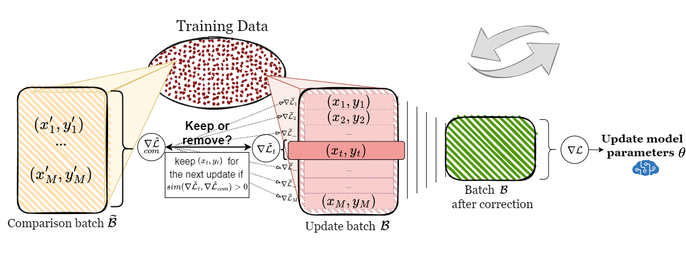

# AGRA
### Adaptive GRAdient-based outlier removal


This repository contains code used in our paper:
**["Learning with Noisy Labels by Adaptive Gradient-Based Outlier Removal"](https://arxiv.org/pdf/2306.04502.pdf)**
to be presented at ECML PKDD 2023 </br>
by Anastasiia Sedova, Lena Zellinger, and Benjamin Roth. 

For any questions please [get in touch](mailto:anastasiia.sedova@univie.ac.at).

--- 

### Gradient-based outlier removal

--- 

### AGRA

<p align="center">
  
</p>

---

### Usage 

---

### Citation

When using our work please cite our ArXiV preprint: 

```
@misc{sedova2023learning,
      title={Learning with Noisy Labels by Adaptive Gradient-Based Outlier Removal}, 
      author={Anastasiia Sedova and Lena Zellinger and Benjamin Roth},
      year={2023},
      eprint={2306.04502},
      archivePrefix={arXiv},
      primaryClass={cs.LG}
}
```

### Acknowledgements 💎

This research has been funded by the Vienna Science and Technology Fund (WWTF)[10.47379/VRG19008] and by the Deutsche Forschungsgemeinschaft (DFG, German Research Foundation) RO 5127/2-1.
